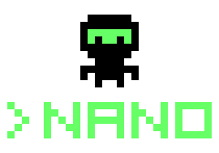
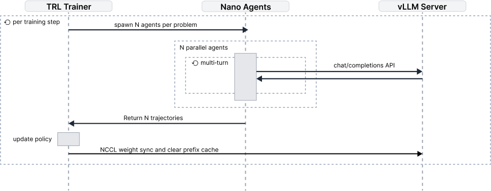

<!-- _class: lead -->

# Reinforcement Learning for Automated Program Repair

## A Single-Agent Investigation on SWE-Bench

**Bjarni Haukur Bjarnason**
KTH Royal Institute of Technology

**Supervisor**: André Afonso Nunes Silva
**Examiner**: Martin Monperrus

2025

---

<!-- _footer: "KTH Royal Institute of Technology | Thesis Defense 2025" -->

# Overview

**Research Focus**: Open, execution-free RL training for coding agents

**Key Elements**:
- Single minimalist agent (Nano) with two tools: `shell()` and `apply_patch()`
- Training on patch-similarity rewards without test execution
- 1,000-task curriculum: 750 Python + 250 multilingual tasks
- GSPO policy optimization with live weight synchronization

**Evaluation**:
- SWE-Bench-Verified (500 Python tasks)
- SWE-Bench-Multilingual holdout (50 tasks, 9 languages)

---

# The Problem

**Training-Deployment Mismatch**:
- Deployment requires dynamic, multi-turn interaction
- Training typically uses static datasets of isolated code changes

**Proprietary Methods**:
- Frontier labs (Anthropic, OpenAI) likely use agentic training
- Methods remain closed-source
- Open-source community lacks reproducible recipes

**Our Contribution**:
One of the first fully open training recipes for coding agents

---

# Research Questions

**RQ1: Harness Adaptation**
How does GSPO training improve Nano agent's tool use?
- Tool-call success rate, invalid-call reduction
- Command usage evolution

**RQ2: Performance Improvement**  
Does execution-free patch-similarity RL improve SWE-Bench-Verified success?
- Test-verified success rates pre/post training

**RQ3: Multilingual Training**
Does execution-free RL enable effective multilingual training?
- Per-language reward improvements on 50-task holdout
- No language-specific engineering required

---

# Core Contributions

**1. Open Training Recipe**
Complete infrastructure for online RL with coding agents
- Training methodology, configurations, harness specifications
- Democratizes techniques previously limited to industry labs

**2. Minimalist Agent Design**  
Sophisticated debugging from simple interfaces
- Two tools: `shell()` and `apply_patch()`
- Behaviors emerge through learning, not engineering

**3. Execution-Free Paradigm**
Language-agnostic patch-similarity rewards
- No test runners, build systems, or containers needed
- Enables unified multilingual training

---

# Scope & Paradigm

**Single-Agent Focus**:
- All training within Nano harness
- No scaffold engineering or prompt optimization
- Model learns optimal tool usage through environmental feedback

**Execution-Free Setup**:
- Terminal exploration without test execution
- Rewards from static patch comparison (difflib similarity)
- Trades functional verification for:
  - Infrastructure simplicity
  - Deterministic training
  - Multilingual scalability

---

# Delimitations

**Task Scope**: Automated bug repair where errors exist
- Single-commit bug fixes
- Not: Multi-stage refactoring, architectural changes

**Compute Constraints**: Academic resources
- 3 A100 GPUs (2 training, 1 inference)
- ~288 A100-hours total vs. ~10,368 H100-hours (DeepSWE)
- Required aggressive memory optimization

**Model Focus**: Qwen3-14B primary
- Hybrid reasoning model with strong tool-calling
- Limited comparisons with 8B, 30B-A3B, 32B variants

---

<!-- _class: section-title -->

# Background & Related Work

---

# APR Evolution: Pre-LLM Era

**Historical Approaches** (Defects4J, QuixBugs benchmarks):

**Generate-and-Validate**
- GenProg: Mutation-based search with test validation
- PAR: Pattern-guided edit selection

**Semantics-Based**  
- SemFix: Symbolic execution + constraint solving

**Learning-Guided**
- Prophet: Statistical models rank candidate patches

**Limitations**: Localized search, brittle test-suite overfitting

---

# APR with LLMs: Scaffold Taxonomy

**Scaffold-Free**: Direct patch generation
- RepairLLaMA: Fine-tuned on bug-fix pairs
- CodeRL: RL with unit test feedback
- *Limitation*: No repository exploration, single-pass generation

**Agentless**: Script-driven interaction
- External harness curates context, applies edits
- Model doesn't control exploration strategy
- *Limitation*: Cannot learn debugging decision-making

**Agentic**: Model-driven interaction
- SWE-Agent, OpenHands, mini-swe-agent
- Model autonomously navigates, edits, iterates
- **Enables end-to-end RL training** ✓

---

# Why Agentic Systems?

**End-to-End Learning**:
- Model learns exploration strategies from experience
- Natural credit assignment: actions → observations → rewards
- Training aligns with deployment behavior

**Natural Interaction**:
- Mirrors human debugging workflow
- Hypothesis formation → investigation → refinement
- Active learning vs. passive pattern matching

**Enables RL**:
- Complete trajectories suitable for policy gradients
- Reward signal reflects full decision process
- No scaffold/model responsibility entanglement

---

# Policy Optimization: PPO Foundation

**Proximal Policy Optimization** (Schulman et al., 2017)

Clipped surrogate objective with value baseline:

$$
J_{\text{PPO}}(\theta) = \mathbb{E}\left[\frac{1}{|y|}\sum_{t=1}^{|y|} \min(w_t \hat{A}_t, \text{clip}(w_t) \hat{A}_t)\right] - \beta D_{\text{KL}}(\pi_\theta \| \pi_{\text{ref}})
$$

Where $w_t = \frac{\pi_\theta(y_t | x, y_{<t})}{\pi_{\theta_{\text{old}}}(y_t | x, y_{<t})}$ (per-token importance ratio)

**Key Features**:
- Clipping prevents destructive updates
- Value network $V_\phi$ provides baseline
- **Drawback**: Separate critic doubles memory footprint

---

# Policy Optimization: GRPO Innovation

**Group Relative Policy Optimization** (Shao et al., 2024)

**Key Insight**: Replace learned value baseline with group-relative baseline

Sample $G$ responses per query, compute group advantage:

$$
A_i = \frac{r(x, y_i) - \mu}{\sigma + \varepsilon}, \quad \mu = \frac{1}{G}\sum_{j=1}^G r(x, y_j)
$$

$$
J_{\text{GRPO}}(\theta) = \mathbb{E}\left[\frac{1}{G}\sum_{i=1}^G \frac{1}{|y_i|}\sum_{t=1}^{|y_i|} \min(w_{i,t} A_i, \text{clip}(w_{i,t}) A_i)\right]
$$

**Advantages**: No critic network, lower memory, simpler training
**Issue**: Per-token importance ratios unstable for long sequences

---

# Policy Optimization: GSPO Advancement

**Group Sequence Policy Optimization** (Yuan et al., 2025)

**Core Innovation**: Sequence-level importance weighting

Length-normalized sequence ratio:

$$
s_i(\theta) = \left(\frac{\pi_\theta(y_i | x)}{\pi_{\theta_{\text{old}}}(y_i | x)}\right)^{1/|y_i|} = \exp\left(\frac{1}{|y_i|}\sum_{t=1}^{|y_i|} \log\frac{\pi_\theta(y_{i,t})}{\pi_{\theta_{\text{old}}}(y_{i,t})}\right)
$$

$$
J_{\text{GSPO}}(\theta) = \mathbb{E}\left[\frac{1}{G}\sum_{i=1}^G \min(s_i A_i, \text{clip}(s_i) A_i)\right]
$$

**GRPO → GSPO**:
- **Stability**: Single weight per sequence vs. noisy per-token ratios
- **Robustness**: Tolerates training/inference engine precision differences
- **MoE-friendly**: No routing replay required

---

# RL Algorithm Progression

| Aspect | PPO | GRPO | GSPO |
|--------|-----|------|------|
| **Baseline** | Learned $V_\phi$ | Group mean | Group mean |
| **Importance** | Per-token | Per-token | Per-sequence |
| **Memory** | High (critic) | Lower | Lower |
| **Stability** | Good | Moderate | Superior |
| **Best for** | General RL | Simple tasks | Long sequences, MoE |

**Our Choice**: GSPO + light KL penalty for small batch stability

---

# Related Work: Positioning

**DeepSWE** (Zhang et al., 2025):
- GRPO on multi-turn terminal agents
- Test-based rewards, 64 H100 training + 8 H100 inference
- ~10,368 H100-hours (~22,810 A100-hours equivalent)

**SWE-RL** (Wei et al., 2025):
- GRPO with patch-similarity rewards
- Static single-turn: full context provided, direct patch output
- No interactive tool use

**Our Work**:
- GSPO with patch-similarity in multi-turn agentic setting
- ~288 A100-hours (**~80× less compute than DeepSWE**)
- Model must acquire context through tool use before editing

---

# Evaluation Benchmarks

**SWE-Bench-Verified** (primary evaluation):
- ~500 carefully validated Python debugging tasks
- Real-world repositories (Django, scikit-learn, matplotlib, etc.)
- Deterministic test outcomes
- Test-verified success rates

**SWE-Bench-Multilingual** (generalization):
- 9 programming languages: Rust, Java, PHP, Ruby, JS, TS, Go, C, C++
- 250 tasks in training, 50 in held-out evaluation
- Per-language reward improvements

**Training**: SWE-Gym (750 Python tasks from ~2,400 available)

---

<!-- _class: section-title -->

# Methodology

---

# The Nano Agent Philosophy

<div class="columns">
<div>

**Minimalist Design**:
- Two tools only
- No repository summaries
- No pre-computed context
- Agent discovers everything

**Why Minimal?**:
- Clean experimental isolation
- Emergent complexity through learning
- Avoids scaffold engineering confounds

</div>
<div>



</div>
</div>

---

# Observation Space

**Terminal Transcript**:
- Structured conversation history
- System messages, issue descriptions
- Tool outputs, error messages

**Truncation Policy**:
- Tool outputs: 2,000 characters max
- Explicit `... output truncated ...` marker
- Agent must be strategic with information gathering

**No Free Information**:
- No file trees, no test results, no repository statistics
- Agent must use tools to discover all context

---

# Action Space

**Two Tools**:

**1. `shell(cmd)`**
- Executes within restricted bash (rbash)
- Per-call timeout
- Returns stdout/stderr

**2. `apply_patch(path, old_content, new_content)`**  
- Literal search-and-replace (no regex)
- `old_content` must match uniquely
- Must target files within repository

**Termination**:
- "Null action" (no tool calls) → submission if changes exist
- Tool budget exhausted / token limit / wall-clock timeout

---

# Tool Interaction Example

```python
>>> shell(cmd="ls src/")
drwxr-xr-x  utils/
-rw-r--r--  main.py
-rw-r--r--  config.py

>>> shell(cmd="grep -n 'def process' src/utils.py")
42:def process_data(data):
43:    return data.strip().lower()

>>> apply_patch(
...     file_path="src/utils.py",
...     old_content="return data.strip().lower()",
...     new_content="return data.strip().lower().replace(' ', '_')"
... )
Patch applied successfully.
```

Agent explores → identifies bug → applies targeted fix

---

# Sidestepping Diff Generation

**The Problem**: Unified diffs are brittle
- Line numbers must reflect current file state exactly
- Context lines must match character-for-character
- Headers need correct paths, offsets, chunk sizes
- Models frequently produce malformed diffs

**Our Solution**: Semantic clarity during interaction

1. Agent uses `apply_patch(old, new)` – easy to generate
2. Harness executes literal search-replace
3. After episode: `git diff` computes canonical diff
4. Reward computed from canonical diff vs. ground truth

**Result**: Eliminates entire class of formatting errors

---

# Training Data Curriculum

**1,000-Task Balanced Curriculum**:

**SWE-Gym** (750 tasks):
- Python debugging tasks from real repositories
- Extracted from ~2,400 available instances
- Diverse bug types and codebases

**SWE-Bench-Multilingual** (250 tasks):
- 9 languages: Rust, Java, PHP, Ruby, JS, TS, Go, C, C++
- Training on multilingual data
- 50-task held-out for evaluation

**Rationale**: Language-agnostic reward enables unified training

---

# Reward Design

**Patch-Similarity Reward** $R(\tau) \in [0, 1]$:

Let $F_a$, $F_g$ = files modified by agent, ground truth

Let $p_a(f)$, $p_g(f)$ = canonical diff hunks for file $f$

$$
R(\tau) = \frac{1}{\max(|F_a|, |F_g|)} \sum_{f \in F_a \cup F_g} \text{similarity}(p_a(f), p_g(f))
$$

**Properties**:
- Terminal supervision (sparse reward at episode end)
- Python's `difflib.SequenceMatcher.ratio()` for similarity
- Files in only one set contribute zero
- Deterministic, language-agnostic, reproducible

---

# GSPO Training Objective

**Our Training Objective**:

$$
J(\theta) = J_{\text{GSPO}}(\theta) - \beta_{\text{KL}} \cdot D_{\text{KL}}(\pi_\theta \| \pi_{\theta_{\text{ref}}})
$$

**Components**:
- $J_{\text{GSPO}}$: Sequence-level clipped surrogate with group advantages
- $\beta_{\text{KL}}$: Light regularization for small batch stability
- $\pi_{\theta_{\text{ref}}}$: Initial pre-trained checkpoint (frozen)

**Rationale**:
- GSPO for long-sequence stability
- KL penalty counteracts gradient variance from limited batch size
- Academic compute constraints require robust optimization

---

<!-- _class: section-title -->

# Implementation

---

# Online RL Architecture

**Challenge**: Enable live policy updates during training

**Solution**: Training-inference duality

<div class="info">

**vLLM Async Engine**:
- OpenAI-compatible API for agent interactions
- Continuous batching for throughput
- Tool call parsing, KV-cache management

**Live Weight Sync**:
- NCCL-based adapter updates without server restart
- Trainer updates policy → broadcasts to vLLM
- Training and inference on separate GPUs

</div>

**Result**: Agent behavior improves continuously during training

---

# Training Sequence Diagram



---

# Async Episode Collection

**Episode-Level Synchronization**:
- Trainer requests N completed episodes
- Internally, agents progress asynchronously (continuous batching)
- Returns batch of complete trajectories for GSPO

**Advantages**:
- Natural fit for multi-turn agents
- Much higher throughput than synchronous per-turn batching
- Satisfies group-relative optimization requirement

**Agent-Application Separation**:
- Same agent code for training and deployment
- Trainer operates only on issues + trajectories
- No agent-specific code in training loop

---

# Live Weight Synchronization

**System Architecture**:

**Trainer Side** (2× A100):
- DeepSpeed distributed training
- After policy update: gather LoRA adapters layer-by-layer
- Merge adapters into base weights
- Broadcast via NCCL to inference server

**Inference Side** (1× A100):
- vLLM async engine with custom NCCL worker
- Receives weight updates layer-by-layer
- Updates model parameters in-place
- **Invalidates KV cache** (cached projections used old weights)

**Synchronization**: No race conditions – training gates new episodes on sync completion

---

# SLURM Orchestration

**Single Batch Job** (Berzelius/Alvis clusters):

```bash
#!/bin/bash
#SBATCH --gpus=3
#SBATCH --time=48:00:00
#SBATCH --mem=200G

# GPU: 0 for inference, 1-2 for training
export CUDA_VISIBLE_DEVICES=0 vllm-server &
export CUDA_VISIBLE_DEVICES=1,2 deepspeed-trainer
```

**Containerization**: Apptainer/Singularity
- Users lack root privileges on shared clusters
- Containers provide exact library versions
- Portable across cluster environments

---

# Compute Optimizations Overview

**Memory Hierarchy** (14B model on 3× A100):

| Component | Optimization | Savings |
|-----------|--------------|---------|
| **Parameters** | LoRA (rank 32) | ~98% trainable params |
| **Optimizer** | DeepSpeed ZeRO-2 | Shard states across GPUs |
| **Activations** | Gradient checkpointing | ~40-60% activation memory |
| **Operations** | Fused Triton kernels | ~40% peak memory (TRL) |
| **Precision** | BF16 mixed precision | 2× memory reduction |
| **Episodes** | Explicit limits + warnings | Bounded context growth |

**Result**: 14B training on 2× A100 (24GB each)

---

# LoRA: Parameter-Efficient Adaptation

**Low-Rank Adaptation**:

$$
W = W_0 + \frac{\alpha}{r} BA, \quad B \in \mathbb{R}^{d \times r}, A \in \mathbb{R}^{r \times k}
$$

**Our Configuration**:
- Rank $r = 32$, scale $\alpha = 64$
- Applied to attention + MLP projections
- Drastically reduces trainable parameters

**Compound Benefits**:
- Smaller optimizer states (proportional to trainable params)
- Reference policy: unmount adapters (no duplicate weights)
- Weight sync: transmit compact adapters vs. full 28GB model
- Training stability: avoid updating billions of pre-trained parameters

---

# Memory Management Stack

**DeepSpeed ZeRO-2**:
- Shard optimizer states + gradients across training GPUs
- Replicate model parameters (14B fits comfortably on 2× A100)
- Avoid ZeRO-3 parameter-gathering latency

**Gradient Checkpointing**:
- Discard activations during forward pass
- Recompute on-demand during backprop
- ~40-60% activation memory savings, ~20-33% compute overhead

**Fused GSPO Kernels** (custom Triton):
- Combine log-prob, masking, weighting, clipping in single kernel
- Eliminate intermediate tensor materialization
- Inspired by Liger-Kernel, TRL fused implementations

---

# Agent Design for Efficiency

**Explicit Episode Limits**:
- Token budget: Prevent OOM as conversation grows
- Tool-call budget: Prevent runaway exploration
- Wall-clock timeout: Bound episode duration

**Progressive Warnings**:
- Agent warned when approaching limits
- Encourages submission attempts
- Ensures episodes yield gradient information

**Rationale**:
- Accommodate realistic debugging workflows
- Avoid aggressive truncation that discards reward-relevant tokens
- Balance memory constraints with learning signal quality

---

<!-- _class: iframe-slide -->

# Early Training Dynamics

<iframe src="../plotting/figures/plots/sankey/early_training_sankey_T25_2m8geyey.html"></iframe>

<div class="smaller">
Command distribution and flow patterns during early training phase
</div>

---

<!-- _class: iframe-slide -->

# Late Training Dynamics

<iframe src="../plotting/figures/plots/sankey/late_training_sankey_T25_2m8geyey.html"></iframe>

<div class="smaller">
Command distribution and flow patterns after training convergence
</div>

---

<!-- _class: lead -->

# Summary: Chapters 0-4

**Methodology**: Execution-free RL with minimalist Nano agent
**Training**: GSPO + patch-similarity rewards on 1,000-task curriculum  
**Infrastructure**: Live weight sync, async episodes, compute-efficient stack

---

<!-- _class: lead -->

WIP

---

<!-- _class: lead -->

# Questions?

**Thank you for your attention**

Bjarni Haukur Bjarnason
bhbj@kth.se

KTH Royal Institute of Technology
Division of Theoretical Computer Science

