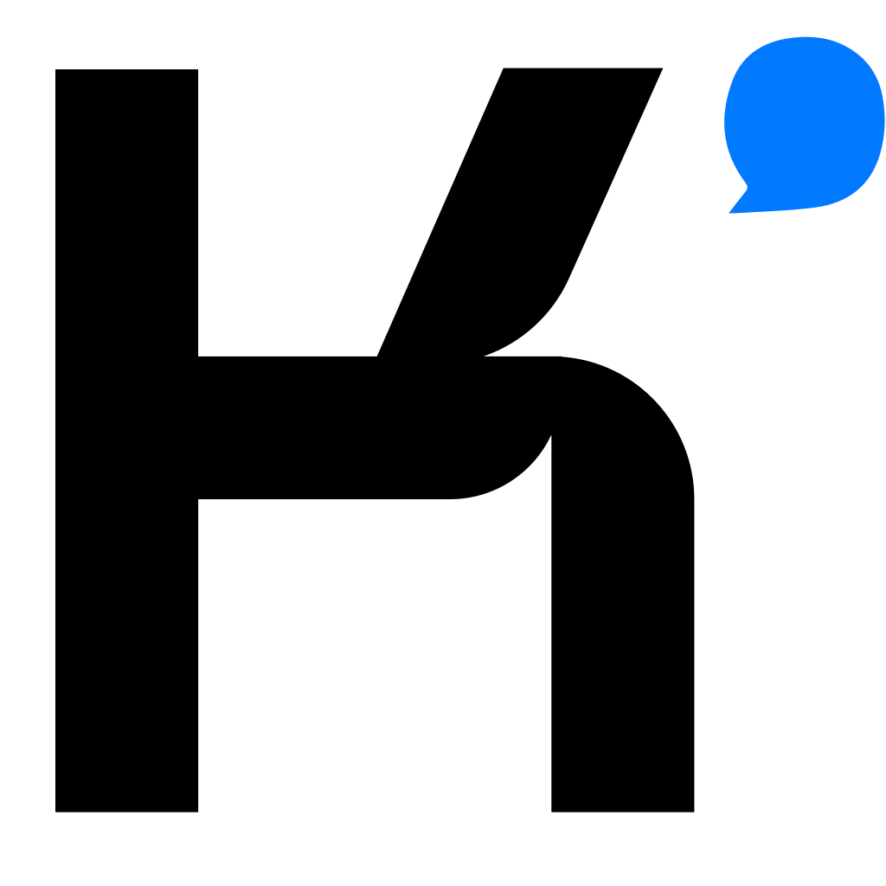
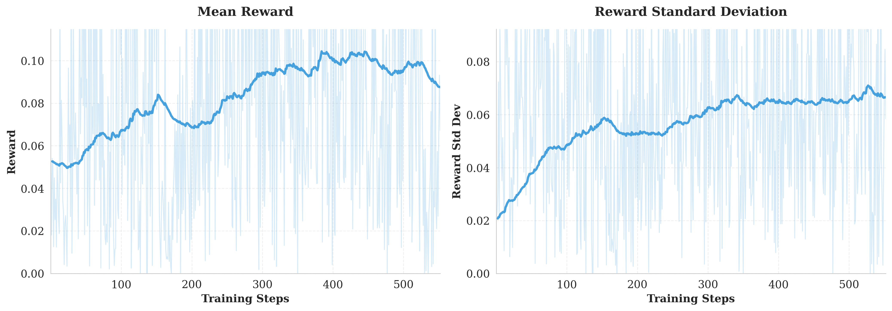
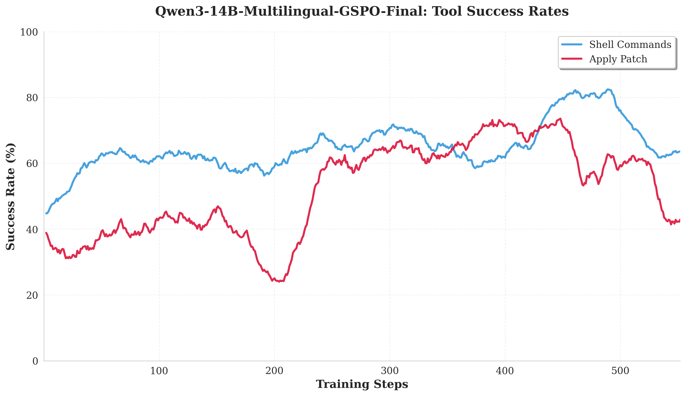
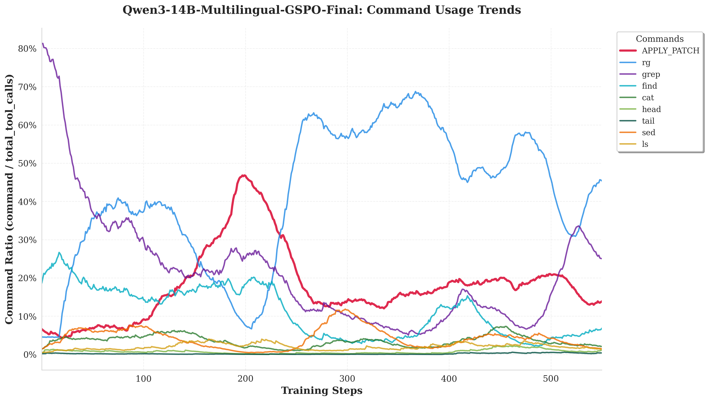
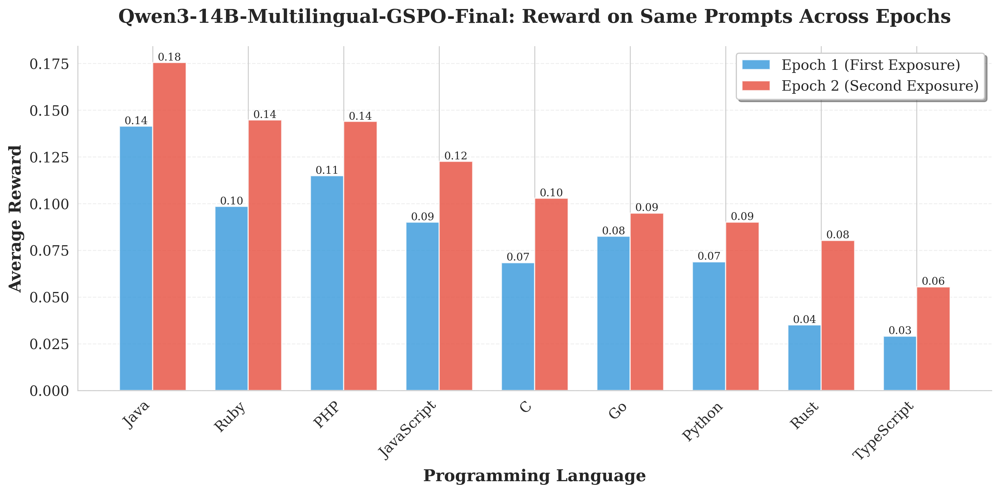

<!-- _class: lead -->

# Learning Agency in the Terminal
## Lessons from Repository-Level Reinforcement Learning

**Bjarni Haukur Bjarnason**

**Supervisor**: André Afonso Nunes Silva
**Examiner**: Martin Monperrus
**Opponent**: Han Tu

<div style="height: 80px;"></div>

**October 2025**

<!--
Welcome everyone—today I'll show you how we trained a debugging agent to learn terminal-based problem-solving through reinforcement learning.
-->

---

# Motivation

Frontier coding agents achieve impressive results, but **training methods remain proprietary**.

Even "open-source" releases don't include training recipes.

<div style="display: flex; align-items: center; justify-content: center; gap: 80px; margin-top: 40px;">
<div style="min-width: 300px;">

### Reasons why?

- Prohibitively expensive
- Prohibitively complicated

</div>

<div style="border-left: 4px solid #555; height: 120px;"></div>

<div style="min-width: 300px;">

### Solution?

- Make it cheaper
- Make simplifying assumptions

</div>
</div>

<div style="height: 80px;"></div>

<div style="display: flex; justify-content: center; align-items: center; gap: 100px;">



</div>

<!--
I'd wager that all of us in this room of heard of and used coding agents. Frontier systems like Claude Code and Codex are incredibly useful, but their training methods are completely proprietary.
Even teams like Alibaba Qwen and MoonshotAI Kimi who do "open" research don't publish full recipes. Just weights and algorithms.
Thus the open resource community suffers

- Two barriers: cost (tens of thousands of GPU-hours), complexity (distributed systems)
- Our solution: execution-free rewards + language-agnostic design = cheap & simple
- Result: one of the first fully open training recipes for agentic debugging
-->

---

# Core Contributions

**1. Open training recipe for online RL on LLMss**
- Implemented live weight synchronization
- Enables multi-turn, tool-using, asynchronous episodes

**2. Academic-scale feasibility**
- 6× A100 GPUs for 32B training, **12× less than DeepSWE**
- 3x A100 GPUs for 14B training

**3. Execution-free training paradigm**
- Single reward function across 10 languages
- No test infrastructure required

<!-- Speaker notes:
So how did we make this possible? Three core contributions.
- Built: first fully open recipe for online RL with coding agents
- Cheap: 120× less compute than comparable systems (academic feasibility)
- Simple: execution-free rewards eliminate infrastructure complexity, enable multilingual training
-->

---

# Presentation Roadmap

**Background & Related Work**
APR evolution, scaffold taxonomy, policy optimization algorithms

**Methodology**
Nano agent design, execution-free rewards, training curriculum

**Implementation**
Live weight synchronization, asynchronous episodes, memory optimizations

**Results**
Four research questions: convergence, adaptation, performance, multilingual generalization

**Discussion & Conclusions**
Key findings, limitations, future work

<!-- Speaker notes:
Here's where we're headed—background, what we built, how it works, results, and conclusions.
-->

---

<!-- _class: section-title -->

# Background & Related Work

<!-- Speaker notes:
First I will establish the foundational background
-->

---

# APR Evolution: Pre-LLM Era

**Generate-and-Validate**
- GenProg: Mutation-based search with test validation
- PAR: Pattern-guided edit selection

**Semantics-Based**
- SemFix: Symbolic execution + constraint solving

**Learning-Guided**
- Prophet: Statistical models rank candidate patches

**Fundamental Limitations**:
- Localized search spaces
- Brittle test-suite overfitting

<!-- Speaker notes:
Three pre-LLM families dominated APR: generate-and-validate (GenProg mutation search, PAR pattern-guided), semantics-based (SemFix symbolic execution), learning-guided (Prophet statistical ranking). All evaluated on Defects4J and QuixBugs. Shared critical limitations: localized search spaces, brittle test-suite overfitting, no semantic reasoning beyond local context. These constraints motivated the shift to LLM-based repository-grounded approaches.
-->

---

# Scaffold Taxonomy for LLM-Based APR

**Scaffold-Free**: Direct patch generation
- RepairLLaMA: Fine-tuned on bug-fix pairs
- CodeRL: RL with unit test feedback at function level

**Agentless**: Script-driven interaction
- External harness curates context, applies edits
- Model doesn't control exploration strategy

**Agentic**: Model-driven interaction
- SWE-Agent, OpenHands, mini-swe-agent
- Model autonomously navigates, edits, iterates

---

# Why Agentic Systems Enable RL

**End-to-End Learning**:
- Model learns exploration strategies from experience
- Natural credit assignment: actions → observations → rewards
- Training aligns with deployment behavior

**Continuous Conversation Histories**:
- No scaffold-induced context manipulation
- Causal chain preserved for gradient-based learning
- Reward reflects full decision process, not scaffold choices


<!-- Speaker notes:
Agentic systems are therefore uniquely positioned for end2end learning
- End-to-end learning: model learns exploration strategies, not just text generation
- Continuous histories: no scaffold disruptions, clean gradient flow
- Natural paradigm: hypothesis → investigation → refinement (active learning)
- Result: RL can optimize the full debugging process
-->

---

# Policy Optimization: PPO Foundation

**Proximal Policy Optimization** (Schulman et al., 2017)

Clipped surrogate objective with value baseline:

$$
J_{\text{PPO}}(\theta) = \mathbb{E}\left[\frac{1}{|y|}\sum_{t=1}^{|y|} \min(w_t \hat{A}_t, \text{clip}(w_t) \hat{A}_t)\right] - \beta D_{\text{KL}}(\pi_\theta \| \pi_{\text{ref}})
$$

Where $w_t = \frac{\pi_\theta(y_t \mid x, y_{<t})}{\pi_{\theta_{\text{old}}}(y_t \mid x, y_{<t})}$ (per-token importance ratio)

**Advantages**: Stable updates via clipping, well-established
**Drawback**: Separate critic $V_\phi$ doubles memory footprint

---

# Policy Optimization: GRPO Innovation

**Group Relative Policy Optimization** (Shao et al., 2024)

**Key Insight**: Replace learned value baseline with group-relative baseline

Sample $G$ responses per query, compute group advantage:

$$
A_i = \frac{r(x, y_i) - \mu}{\sigma + \varepsilon}, \quad \mu = \frac{1}{G}\sum_{j=1}^G r(x, y_j)
$$

$$
J_{\text{GRPO}}(\theta) = \mathbb{E}\left[\frac{1}{G}\sum_{i=1}^G \frac{1}{|y_i|}\sum_{t=1}^{|y_i|} \min(w_{i,t} A_i, \text{clip}(w_{i,t}) A_i)\right]
$$

**Advantages**: No critic network, lower memory, simpler training
**Issue**: Per-token importance ratios unstable for long sequences


<!-- Speaker notes:
GRPO's innovation was eliminating the critic network by using group-relative advantages—simpler but unstable for long sequences.
- Key insight: replace learned baseline with group mean
- Advantage: no critic = half the memory
- Problem: per-token importance ratios become noisy with long agent trajectories
-->

---

# Policy Optimization: GSPO Advancement

**Group Sequence Policy Optimization** (Yuan et al., 2025)

**Core Innovation**: Sequence-level importance weighting


$$
s_i(\theta) = \left(\frac{\pi_\theta(y_i \mid x)}{\pi_{\theta_{\text{old}}}(y_i \mid x)}\right)^{1/|y_i|} = \exp\left(\frac{1}{|y_i|}\sum_{t=1}^{|y_i|} \log\frac{\pi_\theta(y_{i,t})}{\pi_{\theta_{\text{old}}}(y_{i,t})}\right)
$$

$$
J_{\text{GSPO}}(\theta) = \mathbb{E}\left[\frac{1}{G}\sum_{i=1}^G \min(s_i A_i, \text{clip}(s_i) A_i)\right]
$$

**GRPO → GSPO Benefits**:
- Superior stability: single weight per sequence vs. noisy per-token ratios
- Robustness: tolerates training/inference engine precision differences


<!-- Speaker notes:
GSPO solves GRPO's stability problem with sequence-level weighting—this is why our training converges reliably despite long agent trajectories.
- Core innovation: one importance weight per sequence (not per token)
- Length-normalized ratio prevents sequence length bias
- Benefits: superior stability, robust to precision differences, MoE-friendly
- This choice was critical for our small-batch academic setup
-->

---

# Positioning: Related Concurrent Work

**SWE-RL** (Wei et al., 2025):
- Agentless GRPO with patch-similarity rewards
- **Static single-turn**: full context provided, no interactive tool use

**DeepSWE** (Zhang et al., 2025):
- Agentic GRPO with test-based rewards
- ~10,368 H100-hours (at least 16,000 A100-hours equivalent)

**Our Work**:
- GSPO with patch-similarity
- ~ 144 A100-hours (**~120× less GPU hours than DeepSWE**)


---

# Datasets

**Training (1,000 tasks)**:
- SWE-Gym: 750 out of 2440 Python debugging tasks from real repositories
- SWE-Bench-Multilingual: 250 tasks across 9 languages (Rust, Java, PHP, Ruby, JS, TS, Go, C, C++)

**Evaluation (500 tasks)**:
- SWE-Bench-Verified: 500 Python tasks
- SWE-Bench-Multilingual: 50 held-out multilingual tasks (not used)


<!-- Speaker notes:
We evaluate on SWE-Bench-Verified and test multilingual generalization, training on 1,000 tasks across 10 languages.
- Primary: SWE-Bench-Verified (~500 Python tasks, test-verified)
- Multilingual: SWE-Bench-Multilingual (9 languages, 50 held-out)
- Training: 750 Python + 250 multilingual = 1,000-task curriculum
-->

---

<!-- _class: section-title -->

# Methodology


<!-- Speaker notes:
Now let's see how we built the training system—starting with our minimalist agent design.
-->

---

# Nano Agent
<!-- # Agent Design for Efficiency

**Explicit Episode Limits** (dual purpose):

**Memory Constraints**:
- Token budget: prevent OOM as conversation grows
- Tool-call budget: prevent runaway exploration
- Wall-clock timeout: bound episode duration

**Sample Efficiency**:
- Progressive warnings as limits approach
- Encourages submission attempts
- Ensures episodes yield gradient information (even for unsolved tasks)

**Configuration**:
- 30 tool calls max
- 10,240 generated tokens max
- ~60 second timeout
- 2,000 char truncation per tool output -->
<div class="columns">
<div>

**Two tools only**
- `shell` to navigate and read
- `apply_patch` to affect files
- No repository summaries
- No pre-computed context
- Fully agentic

**Explicit episode limits**
- Token limit: 10,240
- Tool call limit: 30
- Time limit: 60s

</div>
<div>


</div>
</div>

---

# Tool Interaction Example

```
shell(cmd="ls src/")
drwxr-xr-x  utils/
-rw-r--r--  main.py
-rw-r--r--  config.py

shell(cmd="grep -n 'def process' src/utils.py")
42:def process_data(data):
43:    return data.strip().lower()

apply_patch(
  file_path="src/utils.py",
  old_content="return data.strip().lower()",
  new_content="return data.strip().lower().replace(' ', '_')"
)
Patch applied successfully.
```

Agent explores → identifies bug → applies targeted fix


<!-- Speaker notes:
Here's the workflow in action: explore the repository, identify the issue, apply a targeted fix.
-->

---

# Sidestepping Diff Generation Complexity

**Agent uses semantic search-replace → git computes canonical diff**

<div style="padding: 12px; border-radius: 4px; font-family: 'Courier New', monospace; font-size: 20px; line-height: 1.6; margin: 20px 0; white-space: pre;">$ git diff
diff --git a/src/utils.py b/src/utils.py
index abc123..def456 100644
<span style="color: #0066cc;">--- a/src/utils.py</span>
<span style="color: #0066cc;">+++ b/src/utils.py</span>
<span style="color: #008080;">@@ -42,1 +42,1 @@ def process_data(data):</span>
<span style="color: #cc0000;">-    return data.strip().lower()</span>
<span style="color: #009900;">+    return data.strip().lower().replace(' ', '_')</span></div>

**Eliminates brittle diff formatting errors**

--- 

# Execution-Free Reward Design

**Patch-Similarity Reward** $R(\tau) \in [0, 1]$:

Let $F_a, F_g$ = files modified by agent, ground truth

Let $p_a(f), p_g(f)$ = canonical diff hunks for file $f$

$$
R(\tau) = \frac{1}{\max(|F_a|, |F_g|)} \sum_{f \in F_a \cup F_g} \text{similarity}(p_a(f), p_g(f))
$$

**Properties**:
- Python's `difflib.SequenceMatcher.ratio()` for similarity
- Files in only one set contribute zero
- **Deterministic, language-agnostic, easily reproducible**


<!-- Speaker notes:
Patch-similarity is the core technical innovation that enables language-agnostic, scalable training without test execution infrastructure.
- Compares agent's diff to ground-truth diff using sequence matching
- Averaged over all modified files (union of agent and ground-truth file sets)
- Properties: deterministic, language-agnostic, reproducible, no execution needed
- Trade-off: gives up functional verification for massive simplicity + multilingual scalability
- Result: train on 10 languages with a single reward function
-->

---

# Patch-Similarity Examples

**No Similarity (R < 0.1)** — Different files → minimal overlap

<div style="display: flex; justify-content: center; margin: 20px 0;">
<div style="display: grid; grid-template-columns: 1fr 1fr; gap: 30px;">

<div>
<strong>Agent Patch:</strong>

<div style="padding: 12px; border-radius: 4px; font-family: 'Courier New', monospace; font-size: 18px; line-height: 1.5; margin-top: 8px; white-space: pre;">
<span style="color: #0066cc;">--- a/config.py</span>
<span style="color: #0066cc;">+++ b/config.py</span>
<span style="color: #008080;">@@ -8,1 +8,1 @@</span>
<span style="color: #cc0000;">-MAX_SIZE = 1024</span>
<span style="color: #009900;">+MAX_SIZE = 2048</span>
</div>

</div>

<div>
<strong>Ground Truth Patch:</strong>

<div style="padding: 12px; border-radius: 4px; font-family: 'Courier New', monospace; font-size: 18px; line-height: 1.5; margin-top: 8px; white-space: pre;">
<span style="color: #0066cc;">--- a/server.py</span>
<span style="color: #0066cc;">+++ b/server.py</span>
<span style="color: #008080;">@@ -12,1 +12,1 @@</span>
<span style="color: #cc0000;">-PORT = 8000</span>
<span style="color: #009900;">+PORT = 9000</span>
</div>

</div>

</div>
</div>

---

# Patch-Similarity Examples

**Partial Match (R ≈ 0.75)** — Same file, same idea, different structure

<div style="display: flex; justify-content: center; margin: 20px 0;">
<div style="display: grid; grid-template-columns: 1fr 1fr; gap: 30px;">

<div>
<strong>Agent Patch:</strong>

<div style="padding: 12px; border-radius: 4px; font-family: 'Courier New', monospace; font-size: 18px; line-height: 1.5; margin-top: 8px; white-space: pre;">
<span style="color: #0066cc;">--- a/parser.py</span>
<span style="color: #0066cc;">+++ b/parser.py</span>
<span style="color: #008080;">@@ -18,3 +18,4 @@</span>
 def parse(text):
<span style="color: #cc0000;">-    return text</span>
<span style="color: #009900;">+    tokens = text.split()</span>
<span style="color: #009900;">+    return tokens</span>
</div>

</div>

<div>
<strong>Ground Truth Patch:</strong>

<div style="padding: 12px; border-radius: 4px; font-family: 'Courier New', monospace; font-size: 18px; line-height: 1.5; margin-top: 8px; white-space: pre;">
<span style="color: #0066cc;">--- a/parser.py</span>
<span style="color: #0066cc;">+++ b/parser.py</span>
<span style="color: #008080;">@@ -18,1 +18,1 @@</span>
<span style="color: #cc0000;">-    return text</span>
<span style="color: #009900;">+    return text.split()</span>
</div>

</div>

</div>
</div>


<!-- Speaker notes:
Top: agent modified validate function signature, ground truth modified parse function logic—same file but different functions, near-zero similarity. Bottom: both modify parse to return split text, but agent uses intermediate variable—partial structural match, around 0.5 similarity.
-->

---

# GSPO Training Objective

**Our Training Objective**:

$$
J(\theta) = J_{\text{GSPO}}(\theta) - \beta_{\text{KL}} \cdot D_{\text{KL}}(\pi_\theta \| \pi_{\theta_{\text{ref}}})
$$

**Components**:
- $J_{\text{GSPO}}$: Sequence-level clipped surrogate with group advantages
- $\beta_{\text{KL}}$: Light regularization for small batch stability
- $\pi_{\theta_{\text{ref}}}$: Initial pre-trained checkpoint (frozen)

**Rationale**:
- GSPO provides superior stability for long-sequence agent training
- KL penalty counteracts gradient variance from limited batch size


<!-- Speaker notes:
- GSPO: sequence-level clipped surrogate with group advantages
- KL penalty: regularization for small-batch stability (critical for 3 GPUs)
- Reference policy: frozen initial checkpoint
-->

---

# Model Selection: Qwen3-14B

**Why Qwen3?**
- Hybrid reasoning model with strong tool-calling capabilities
- Community consensus: strongest open-weight models at the time

**Why 14B?**
- **Practical constraint**: 8B too large for 2 GPUs, too small for 3
- 32B requires 6 GPUs minimum
- 14B optimal fit for 3× A100 allocation

<!-- Speaker notes:
Need power of 2 for both training and inference
-->

---

<!-- _class: section-title -->

# Implementation & Infrastructure


<!-- Speaker notes:
The infrastructure had to solve a hard problem: continuous policy improvement without server restarts.
-->

---

# Live Weight Synchronization via NCCL

**Key Innovation**: Continuous policy improvement without server restarts

Training broadcasts weight updates via NCCL to a deployed **OpenAI-compatible API server**

**This means**: Any AI application that speaks OpenAI API can be trained with this infrastructure

**Ships with**: All vLLM inference optimizations and first-class features like tool calling 

**Generality**: Same agent code for training and deployment


<!-- Speaker notes:
The breakthrough is NCCL weight sync to an OpenAI-compatible API server—this makes the infrastructure general. Any AI application speaking that API can be trained. Nano agent, but also any other agentic system. Training and inference run on separate GPUs, weights sync via NCCL broadcasts, agents progress asynchronously. No server restarts, no coupling between trainer and agent code.
-->

---

# Training Infrastructure


<!-- Speaker notes:
This diagram shows the full training loop—the key innovation is NCCL weight synchronization enabling continuous policy updates.
-->

---

# Compute Optimizations Overview

| Component | Optimization | Benefit |
|-----------|--------------|---------|
| **Parameters** | LoRA (rank 32) | ~98% fewer trainable params |
| **Optimizer** | DeepSpeed ZeRO-2 | Shard states across GPUs |
| **Gradients** | Accumulation (4 steps) | 4× effective batch size |
| **Activations** | Gradient checkpointing | ~40-60% activation memory |
| **Operations** | Fused Triton kernels | ~40% peak memory (TRL) |
| **Precision** | BF16 mixed precision | 2× memory reduction |
| **Episodes** | Explicit limits + warnings | Better reward signals |

**Compositionality**: Each optimization addresses distinct bottleneck

**Result**: 14B training on 2× A100, 1x A100 for inference

<!-- Speaker notes:
Making 14B training fit on 3 A100s required stacking every memory optimization available—this is how we achieved 120× cost reduction.
- LoRA: train 0.35% of parameters (rank 32, alpha 64)
- ZeRO-2: shard optimizer states across GPUs
- Gradient checkpointing: trade compute for memory
- Flash Attention 2 + fused kernels: faster + less memory
- Result: 14B fits in 80GB with batch size 4
-->

---

<!-- _class: section-title -->

# Experimental Results


<!-- Speaker notes:
Now the payoff—did it work? Four research questions about convergence, adaptation, multilingual generalization, and system performance.
-->


---

# RQ0: Training Convergence

**Research Question**: Does GSPO training converge effectively with execution-free rewards?

**Primary Indicators**:
- Reward progression, variance evolution, policy gradient signal stability

**Analysis**:
- Reward mean and standard deviation trends over training

**Hypothesis**: 
Execution-free patch-similarity rewards provide sufficient signal for policy convergence despite not directly optimizing for functional correctness


<!-- Speaker notes:
Does execution-free training even work? Can patch-similarity rewards drive policy convergence without test execution?
- Indicators: reward progression, variance evolution, gradient signal
- Hypothesis: patch-similarity is enough signal despite not optimizing for test passage
-->

---

# RQ0: Reward Progression




<!-- Speaker notes:
Yes—training converges! 
- No variance collapse: strong gradient signal throughout
- 3 A100s, 2 days wall-clock, 144 GPU-hours total
-->

---

# RQ0: Why Variance Matters

In group-relative methods like GSPO, advantages compare each response against within-group statistics:

$$
A_i = \frac{r(x, y_i) - \mu}{\sigma + \varepsilon}
$$

**When all rewards are similar**:

- Advantages approach zero → no gradient signal → learning stops

**Our variance increased throughout training**:
- Policy generates diverse outcomes with different rewards
- Implies there is more to learn


<!-- Speaker notes:
Why does increasing variance matter? In GSPO, variance collapse kills learning—advantages approach zero and gradients disappear.
- GSPO advantages normalize by group statistics: A = (r - μ) / σ
- If σ collapses: all advantages → 0, no gradient signal
- Our variance increased: policy generates diverse outcomes with different rewards
- This proves the policy gradient signal stayed strong throughout training
-->

---

# RQ1: Harness Adaptation Overview

**Research Question**: How does GSPO training improve Nano harness adaptation?

**Measured Dimensions**:
1. **Episode Length**: Tool calls per episode
2. **Tool Success Rates**: Valid tool call generation
3. **Command Usage**: Strategic debugging patterns

**Hypothesis**: RL training improves operational behavior alongside reward progression

---

# RQ1: Episode Length Evolution


<!-- Speaker notes:
Early training shows "death spiral" behavior—repeatedly calling failing tools until hitting the 30-call budget, then learning efficiency.
- Early: consistently exhausts 30-call budget
- Pattern: repeated failures, no termination decision
- Late: episodes shorten to 10-15 calls
- Learning: both efficiency and when to stop
-->

---

# RQ1: Tool Execution Success Rates



<!-- Speaker notes:
Shell success rates nearly doubled—and this happened during the budget-exhaustion phase, so it's learning better tool use, not just selectivity.
- Shell: 45% → 80% (+78% improvement)
- apply_patch: volatile but trending up
- Key: improvements during high-call-count phase = learning better generation
- Not just: learning to be selective
-->

---

# RQ1: Command Usage Evolution



<!-- Speaker notes:
Strategic shift from basic navigation to focused debugging—grep emerges, while ls/cd decline.
- Early: heavy ls, cd (basic navigation)
- Late: grep, focused searches (targeted debugging)
- apply_patch spike at step 200: over-exploration during reward dip
- Evidence: policy learns strategic exploration patterns
-->

---

<!-- _class: iframe-slide -->

# Early Training Command Flow

<div class="iframe-wrapper">
<div style="transform: scale(0.4); transform-origin: center center;">
<iframe src="../plotting/figures/plots/sankey/early_training_sankey_T25_8dc73bp4.html" style="width: 2800px; height: 1400px; border: none;"></iframe>
</div>
</div>

<div class="smaller">
Command distribution and transition patterns during early training (first 20% episodes)
</div>


<!-- Speaker notes:
Early training: chaotic command flow with lots of basic navigation—look at the thickness of cd and ls flows.
-->

---

<!-- _class: iframe-slide -->

# Late Training Command Flow

<div class="iframe-wrapper">
<div style="transform: scale(0.4); transform-origin: center center;">
<iframe src="../plotting/figures/plots/sankey/late_training_sankey_T25_8dc73bp4.html" style="width: 2800px; height: 1400px; border: none;"></iframe>
</div>
</div>

<div class="smaller">
Command distribution and transition patterns after training convergence (last 20% episodes)
</div>


<!-- Speaker notes:
Late training: much more focused—grep dominates, less random navigation, cleaner transitions to apply_patch.
-->


---

# RQ2: SWE-Bench-Verified Performance

**Research Question**: Does execution-free patch-similarity RL improve SWE-Bench-Verified performance?

**Evaluation Protocol**:
- Same Nano harness for baseline and post-training
- No scaffold engineering or prompt optimization
- Identical evaluation settings (temperature 0.2, top-p 0.9)

**Metrics**:
- **Completion rate**: episodes producing non-empty patches
- **Resolve rate**: test-verified success
- **Mean reward**: patch-similarity on same instances


<!-- Speaker notes:
Does patch-similarity training improve test-verified success? Same harness, no prompt engineering, just policy updates.
- Same Nano harness for baseline and post-training
- No scaffold changes or prompt optimization
- Metrics: completion rate, resolve rate (test-verified), mean reward
-->

---

# RQ2: Test-Verified Results

| Metric | Baseline | Ours (step 460) | Change |
|--------|----------|-----------------|--------|
| **Completed instances** | 186 (37.2%) | 388 (77.6%) | **+108%** |
| **Resolved instances** | 36 (7.2%) | 31 (6.2%) | -13.9% |
| **Empty patches** | 313 (62.6%) | 111 (22.2%) | **-64.5%** |

**Key Findings**:
1. **Dramatic operational improvement**: completion rate more than doubles
2. **Test-verified success flat**: 7.2% → 6.2% (likely within error margins)
3. Empty-patch failures reduced by 64%

**Interpretation**: Training successfully acquired first capability tier (reliable harness operation) but not yet functional correctness


<!-- Speaker notes:
Mixed results: completion rates doubled, but test-verified success stayed flat—we learned operational competence but not yet functional correctness.
- Completion: 37% → 78% (+108%) — huge improvement
- Test-verified resolve: 7.2% → 6.2% (flat, within error margins)
- Empty patches: down 64% (313 → 111)
- Interpretation: acquired Tier 1 capability (reliable operation) but not Tier 2 (functional correctness)
- Rewards increased 54%, so learning is happening—just not translating to tests yet
-->

---

# RQ2: Reward Progression Context

| Metric | Baseline | Ours (step 460) |
|--------|----------|-----------------|
| **Mean patch-similarity reward** | 0.122 | **0.189** |
| **Improvement** | — | **+54%** |


**Optimistic interpretation:**
1. First: Escape zero-reward regime ✓
2. Then: Climb toward functional correctness ← (not yet)


<!-- Speaker notes:
Patch-similarity rewards did increase substantially—54% improvement—validating that learning occurred.
- Baseline mean: 0.122, Ours: 0.189 (+54%)
- Baseline heavily skewed: 313 empty patches (zero reward by definition)
- Natural hierarchy: first escape zero-reward regime, then climb toward quality
- Step 460: successfully acquired Tier 1, beginning Tier 2 climb
-->

---

# RQ3: Multilingual Performance

**Research Question**: Does execution-free RL improve performance across programming languages without language-specific engineering?

**Evaluation Approach**:
- Compare average per-language rewards on **same problem instances**
- Epoch 1 average vs. Epoch 2 average

**Key Constraint**:
- Uneven data distribution (Python-heavy curriculum)
- Limited multilingual instruction-driven data available
- Validates language-agnostic reward design


<!-- Speaker notes:
Does execution-free RL generalize across languages without language-specific engineering? We test on 9 languages.
- Compare same instances: epoch 1 vs. epoch 2 (controls for difficulty)
- Direct measure of learning progression per language
- Constraint: Python-heavy curriculum (750/1000 tasks)
-->

---

# RQ3: Per-Language Improvements



**Consistent improvements** across diverse languages


<!-- Speaker notes:
All nine languages show measurable improvements from epoch 1 to epoch 2—validation that patch-similarity training works across diverse ecosystems.
- All languages: consistent gains
- Java, Ruby, PHP: highest absolute (0.12-0.18)
- Rust, TypeScript: lower absolute but clear progression (0.06-0.08)
- Evidence: language-agnostic reward enables unified training
-->

---

<!-- _class: section-title -->

# Discussion & Conclusions


<!-- Speaker notes:
Let's synthesize what we learned, acknowledge limitations, and chart future directions.
-->

---

# Key Findings Summary

<div style="display: grid; grid-template-columns: 1fr 1fr; gap: 20px; margin-top: 40px;">

<div>

**RQ0: Training Convergence (✓)**
- Rewards doubled, variance increased
- Execution-free rewards sufficient

</div>

<div>

**RQ1: Harness Adaptation (✓)**
- Shell success: 45% → 80%
- Strategic command emergence
- Policy-harness co-adaptation

</div>

<div>

**RQ2: SWE-Bench Benchmarks (!)**
- Completion: 37% → 78%
- Test success: flat (7.2% → 6.2%)
- Operational, not yet functional

</div>

<div>

**RQ3: Multilingual (✓)**
- Improvements across all 9 languages
- Language-agnostic validated

</div>

</div>


<!-- Speaker notes:
- RQ0: rewards doubled, variance increased = convergence ✓
- RQ1: operational improvements across all metrics ✓
- RQ2: completion doubled, test success flat (operational but not functional) ⚠️
- RQ3: all 9 languages improved, language-agnostic validated ✓
-->

---

# Future Directions

<div style="display: grid; grid-template-columns: 1fr auto 1fr; gap: 60px; margin-top: 40px;">

<div style="display: flex; flex-direction: column; gap: 40px;">

<h3 style="margin-top: 0; text-align: center;">Further Optimizations</h3>

<div>

**Cross-group walltime optimization**
- Slightly off-policy episodes
- Eliminate idle time during training

</div>

<div>

**Unified training-inference architecture**
- Co-locate on single node
- Lower GPU requirements (3 → 1-2)

</div>

</div>

<div style="border-left: 3px solid #004791; height: 100%;"></div>

<div style="display: flex; flex-direction: column; gap: 40px;">

<h3 style="margin-top: 0; text-align: center;">Further Abilities</h3>

<div>

**Extended training**
- Train for a longer time
- Train 32B for longer duration

</div>

<div>

**Multi-task curriculum training**
- Concurrent training on diverse tasks

</div>

</div>

</div>


<!-- Speaker notes:
Several promising directions. Infrastructure: eliminate idle time, reduce GPU requirements. Most important: extended training with larger models—our curves haven't plateaued, DeepSWE showed this works. Multi-task: does debugging skill transfer? And the big open question: where do execution-free methods plateau, or do they scale all the way?
-->

---

# Final Reflections

**AlphaGo learned from human games, then self-play made it superhuman.**

Foundation first. Then reinforcement learning.

But real-world tasks remained out of reach.

**No foundation to build on.**

**LLMs changed everything:**

They provide the prerequisite knowledge to attempt real tasks coherently.

Now RL can finally climb the ladder—from that crucial first rung upward.

**What excites me:**

Decades of RL research now applies to problems that actually matter.

<!-- Speaker notes:
This is what excites me most about this work. AlphaGo learned from human games first—supervised learning gave it the foundation to participate in Go. Then RL through self-play made it superhuman. That's the pattern: foundation first, then reinforcement learning optimizes. But for real-world tasks like coding? We had no foundation. Games give you reward signals for every legal move. Real-world tasks require deep conceptual understanding just to participate meaningfully. Before LLMs, applying RL to coding was futile. Our models couldn't even attempt such problems. The issue wasn't that RL algorithms were broken—they had no gradient to climb, no foundation to build on. LLMs cracked this. They provide the prerequisite knowledge to attempt real tasks coherently. Now when an RL agent tries to fix a bug, it can at least run valid commands, read error messages, generate the rich learning signals RL needs. For the first time, we can apply decades of RL research—exploration strategies, credit assignment, policy optimization—to problems that actually matter. LLMs gave us that crucial first rung on the ladder. We're just beginning to understand what's possible.
-->

---

<!-- _class: lead -->

# Questions?

**Thank you for your attention**

Bjarni Haukur Bjarnason
bhbj@kth.se

KTH Royal Institute of Technology
Division of Theoretical Computer Science